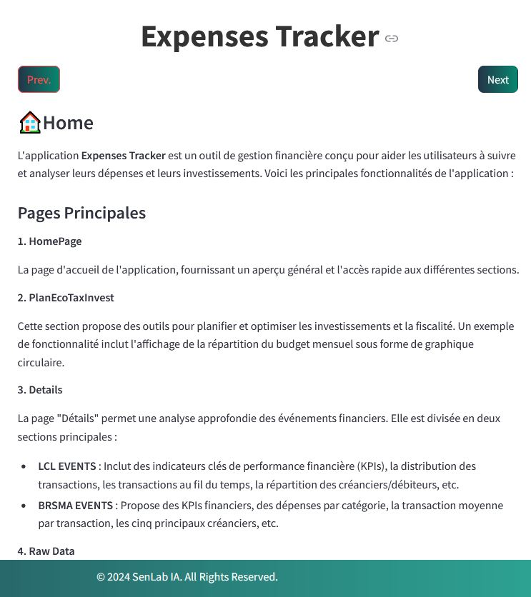
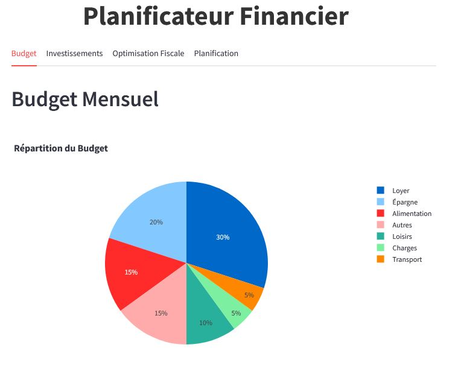
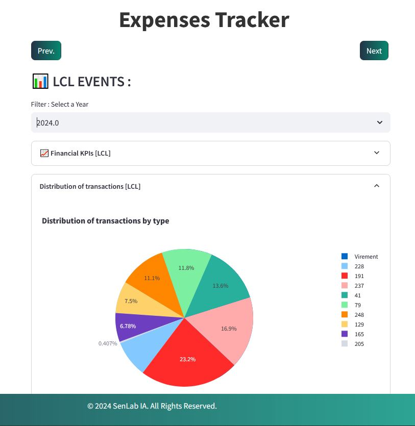
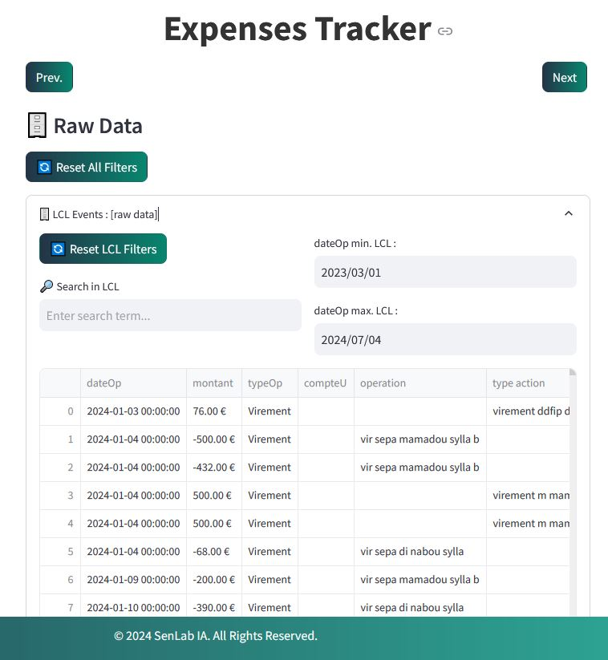

L'application **Expenses Tracker** est un outil de gestion financière conçu pour aider les utilisateurs à suivre et analyser leurs dépenses et leurs investissements. Voici les principales fonctionnalités de l'application :

#### Pages Principales

###### 1. HomePage
La page d'accueil de l'application, fournissant un aperçu général et l'accès rapide aux différentes sections.

**Home Page** :  

 
    </img>

 

###### 2. PlanEcoTaxInvest
Cette section propose des outils pour planifier et optimiser les investissements et la fiscalité. Un exemple de fonctionnalité inclut l'affichage de la répartition du budget mensuel sous forme de graphique circulaire.

**PlanEcoTaxInvest** :  

 
    </img>

 

###### 3. Details
La page "Détails" permet une analyse approfondie des événements financiers. Elle est divisée en deux sections principales :
- **LCL EVENTS** : Inclut des indicateurs clés de performance financière (KPIs), la distribution des transactions, les transactions au fil du temps, la répartition des créanciers/débiteurs, etc.
- **BRSMA EVENTS** : Propose des KPIs financiers, des dépenses par catégorie, la transaction moyenne par transaction, les cinq principaux créanciers, etc.

**Details (LCL & BRSMA)** :  

 
    </img>

 

###### 4. Raw Data
Cette page offre un accès aux données brutes des événements financiers. Les utilisateurs peuvent réinitialiser tous les filtres et explorer les données brutes pour :
- **LCL Events**
- **BRSMA Events**

**Raw data (LCL & BRSMA)** :  

 
    </img>

 

###### 5. AboutMe
Une section pour en savoir plus sur le créateur ou l'équipe derrière l'application.

### Fonctionnalités Clés

- **1. Suivi des dépenses** : Suivi détaillé des différentes catégories de dépenses (loyer, épargne, alimentation, loisirs, etc.).
- **2. Analyse des transactions** : Analyse des transactions financières selon divers critères comme le jour de la semaine, la répartition des créanciers/débiteurs, et plus encore.
- **3. Visualisation des données** : Utilisation de graphiques et de tableaux pour une meilleure compréhension des données financières.
- **4. Planification financière** : Outils pour aider à la planification fiscale et à l'optimisation des investissements.
- **4. Accès aux données brutes** : Possibilité de voir et d'analyser les données financières non traitées pour une analyse plus détaillée.

L'application **Expenses Tracker** est un outil puissant pour quiconque souhaite prendre le contrôle de ses finances et optimiser ses dépenses et investissements.
